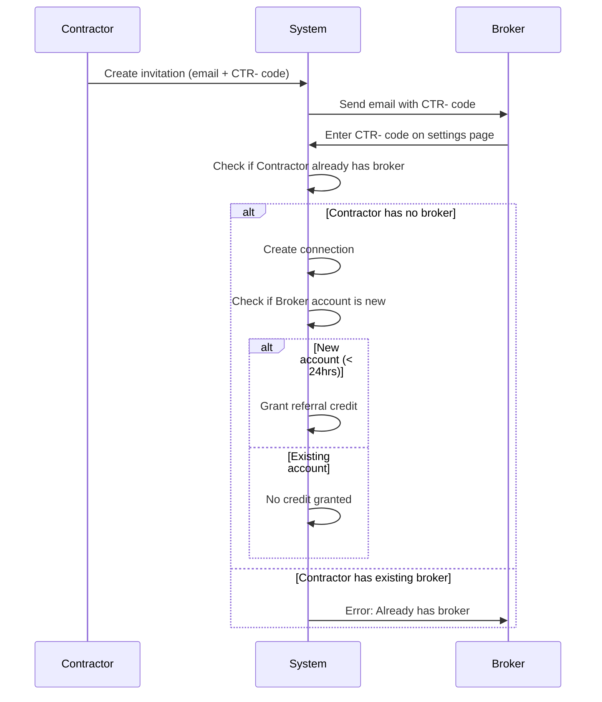
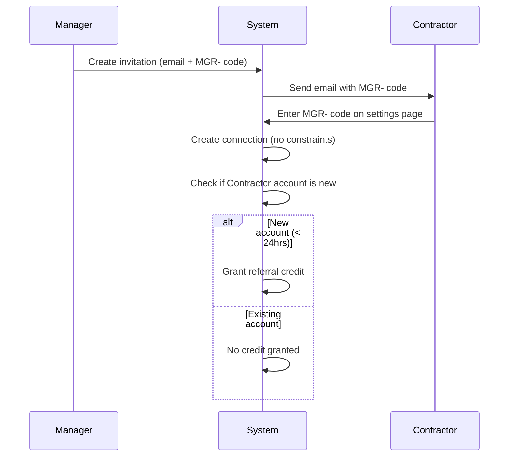
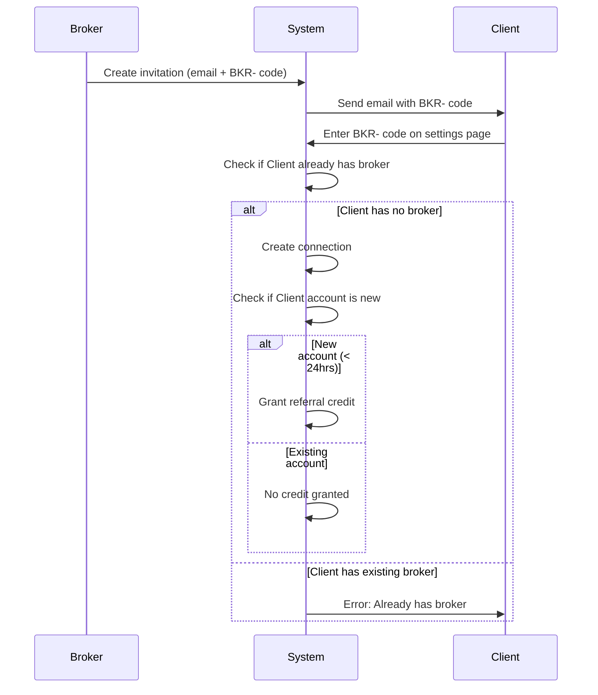

# Bidirectional Connection and Referral System - Implementation Summary

## Overview

This document describes the implemented bidirectional connection system that allows brokers, managers, and contractors to invite and connect with each other using relationship codes or email invitations.

## Business Rules

### 1. Broker Constraint
- **Rule**: Users can have only ONE insurance broker
- **Enforcement**: Checked when accepting invitation (not when sending)
- **Applies to**: Managers and Subcontractors
- **Error Message**: "You already have an insurance broker. Only one broker relationship is allowed."

### 2. Manager Relationships
- **Rule**: Contractors can work with UNLIMITED managers
- **No constraint check**: Contractors can accept any manager invitation

### 3. Broker Client Relationships
- **Rule**: Brokers can have UNLIMITED clients (managers or contractors)
- **No constraint check**: Brokers can invite anyone

### 4. Referral Credits - New Accounts Only
- **Rule**: Referral credits ONLY granted for NEW accounts (< 24 hours old)
- **Existing accounts**: Can connect via codes but receive NO referral credit
- **Rationale**: Prevents gaming the system with existing accounts

### 5. Code Entry Location
- **Rule**: Codes can ONLY be entered on relationship/settings pages
- **NOT on signup/login**: No code entry during account creation
- **Locations**:
  - `/subcontractor/broker` - Enter BKR- codes
  - `/manager/broker` - Enter BKR- codes
  - `/manager/subcontractors` - Enter CTR- codes
  - `/broker/clients` - Enter CTR- or MGR- codes

### 6. Email Matching
- **Rule**: Silent email matching ONLY for NEW signups
- **Existing accounts**: Must manually enter codes
- **Auto-connect**: New accounts automatically connect to pending invitations

## Code Types

### Relationship Codes (Context-Specific)
- **BKR-XXXXXX**: Broker relationship code
  - Display: Broker pages only
  - Purpose: Connect brokers with clients
  
- **CTR-XXXXXX**: Contractor relationship code
  - Display: Contractor pages only
  - Purpose: Connect contractors with managers/brokers
  
- **MGR-XXXXXX**: Manager relationship code
  - Display: Manager pages only
  - Purpose: Connect managers with contractors/brokers

### Referral Codes (General)
- **RFR-XXXXXX**: General referral code
  - Display: Settings/Referrals page only
  - Purpose: General business referrals
  - No relationship created

## Database Schema

### relationship_invitations
```sql
- id: UUID
- inviter_org_id: UUID (who sent invitation)
- inviter_user_id: UUID
- inviter_type: 'broker' | 'subcontractor' | 'manager'
- invitee_email: TEXT (who is being invited)
- invitee_type: 'broker' | 'subcontractor' | 'manager'
- relationship_code: TEXT (BKR/CTR/MGR-XXXXXX)
- status: 'pending' | 'accepted' | 'connected' | 'expired' | 'declined'
- invitee_org_id: UUID (set when connected)
- invitee_user_id: UUID (set when connected)
- referral_credit_granted: BOOLEAN
- metadata: JSONB {
    eligible_for_credit: boolean,
    account_age_at_connection: 'new' | 'existing',
    decline_reason?: string
  }
```

### referrals
```sql
- id: UUID
- referrer_user_id: UUID
- referrer_org_id: UUID
- referred_email: TEXT
- referral_code: TEXT (RFR-XXXXXX)
- status: 'pending' | 'completed' | 'credited' | 'expired'
- credit_amount: DECIMAL
- source_relationship_id: UUID (if from relationship)
```

## Implementation Files

### Core Services
1. **`connectionCodes.ts`**: Code generation and parsing
2. **`relationshipInvitations.ts`**: Invitation creation and connection logic
3. **`referrals.ts`**: General referral management
4. **`referralCredits.ts`**: Credit granting with business rules

### UI Components
1. **`MyBrokerPage.tsx`** (Subcontractor): Invite broker, display CTR- code
2. **`ReferralSettings.tsx`** (All users): Display RFR- code, referral stats
3. **`useReferrals.ts`**: React hook for referral management

### Email Templates
- `sendRelationshipInvitation()`: For BKR/CTR/MGR invitations
- `sendReferralInvitation()`: For RFR- referrals

## Connection Flows

### Flow 1: Contractor Invites Broker


### Flow 2: Manager Invites Contractor


### Flow 3: Broker Invites Client


## Key Functions

### relationshipInvitations.ts

#### `checkExistingBroker(userOrgId, userType)`
- Checks if user already has a broker relationship
- Returns boolean
- Used before accepting broker invitations

#### `isNewAccount(userId, threshold = 24hrs)`
- Checks if account was created within threshold
- Returns boolean
- Determines referral credit eligibility

#### `establishRelationship(invitation, inviteeOrgId, inviteeUserId)`
- Creates relationship record
- Enforces broker constraint
- Checks credit eligibility
- Updates invitation status
- Returns ConnectionResult

#### `connectByRelationshipCode(code, userOrgId, userId)`
- Validates code format and expiration
- Calls establishRelationship
- Returns ConnectionResult with success/error

#### `connectByEmail(email, userOrgId, userId, isNewSignup)`
- Only auto-connects for NEW signups
- Finds pending invitations by email
- Calls establishRelationship for each
- Returns array of ConnectionResults

### referralCredits.ts

#### `grantCreditForRelationship(invitation)`
- Checks if credit already granted
- Validates connection status
- **NEW**: Checks `eligible_for_credit` in metadata
- Only grants credit if account is new
- Returns success/error

## Testing Scenarios

### Scenario 1: New Contractor Signs Up with Broker Invitation
1. Broker sends invitation to contractor@example.com
2. Contractor signs up with that email
3. System auto-connects (new signup)
4. ✅ Referral credit granted (new account)

### Scenario 2: Existing Contractor Enters Broker Code
1. Broker sends invitation to existing-contractor@example.com
2. Existing contractor enters BKR- code on settings page
3. System creates connection
4. ❌ No referral credit (existing account)

### Scenario 3: Contractor Already Has Broker
1. Contractor has existing broker relationship
2. New broker sends invitation
3. Contractor tries to accept
4. ❌ Error: "You already have an insurance broker"
5. Invitation marked as 'declined'

### Scenario 4: Contractor Accepts Multiple Manager Invitations
1. Manager A sends invitation
2. Manager B sends invitation
3. Contractor accepts both
4. ✅ Both connections created (no constraint)

### Scenario 5: Broker Invites Multiple Clients
1. Broker sends invitations to 10 clients
2. All clients accept
3. ✅ All connections created (no constraint)

## Migration Path

### Existing Users
- Existing users can enter codes on settings pages
- No referral credits for existing accounts
- Broker constraint checked at acceptance

### New Users
- Auto-connect via email matching
- Eligible for referral credits
- Broker constraint enforced

## Security Considerations

1. **No Existence Disclosure**: Email matching happens silently
2. **RLS Policies**: Users only see their own invitations
3. **Code Validation**: Expiration and format checks
4. **Constraint Enforcement**: Broker limit enforced server-side
5. **Credit Eligibility**: Account age checked server-side

## Future Enhancements

1. **Notification System**: Notify when invitations accepted/declined
2. **Invitation Management**: Allow canceling pending invitations
3. **Bulk Invitations**: Broker invites multiple clients at once
4. **Invitation Analytics**: Track invitation success rates
5. **Custom Expiration**: Allow custom expiration periods per invitation

## Support

For questions or issues, see:
- Original plan: `.cursor/plans/bidirectional_connection_and_referral_system_71782a42.plan.md`
- UI plan: `.cursor/plans/relationship_2be2aed2.plan.md`
- Database migrations: `packages/supabase/migrations/2025010100000*.sql`

